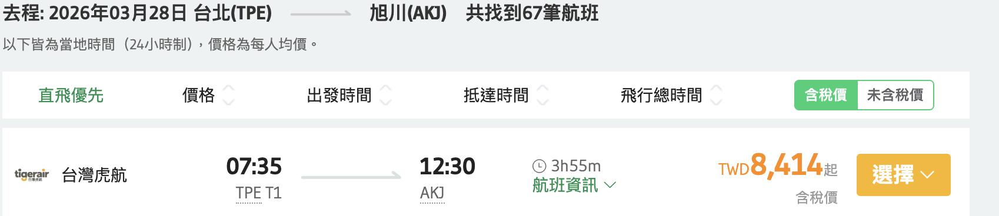
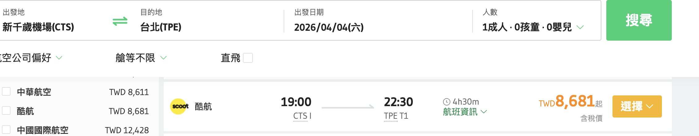
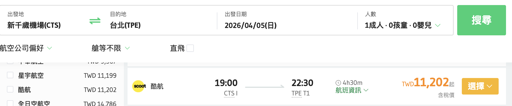

# 2026 北海道滑雪行程（旭川進 → 富良野 → 札幌/小樽/余市 → 新千歲出）

## 📅 行程總覽

| 日期 | 星期 | 行程內容 | 住宿 |
|------|------|----------|------|
| 3/28 | 六 | 台北 → 旭川（Tigerair） 巴士/JR → 富良野 | 富良野 |
| 3/29 | 日 | 富良野滑雪 Day 1 | 富良野 |
| 3/30 | 一 | 富良野滑雪 Day 2 | 富良野 |
| 3/31 | 二 | 富良野滑雪 Day 3 | 富良野 |
| 4/1  | 三 | 富良野滑雪 Day 4 午後 JR → 札幌 | 札幌 |
| 4/2  | 四 | 札幌市區觀光 晚餐：湯咖哩 GARAKU | 札幌 |
| 4/3  | 五 | 余市 Nikka 蒸餾所 + 小樽運河散策 晚餐：炭火兜 成吉思汗 | 札幌 |
| 4/4  | 六 | 札幌慢遊（圓山公園、北海道神宮、藻岩山夜景） | 札幌 |
| 4/5  | 日 | 札幌 → 新千歲 → 台北 | - |

---
## 🛩️ 機票資訊

| 起訖區段 | 時間 | 費用 | 備註 |
|-------------|-------------------------|------|------|
台北 → 旭川機場 |2025/03/28 07:35 ~ 12:30 | 8414 ||
新千歲機場 → 台北 |2025/04/04 19:00 ~ 22:30 | 8681 | |
新千歲機場 → 台北 |2025/04/05 19:00 ~ 22:30 | 8681 | |

---

## 🚍 交通資訊

| 起訖區段 | 方式 | 時間 | 費用 | 備註 |
|----------|------|------|------|------|
| 旭川機場 → 富良野 | 巴士 (Furano Bus) | 約 1h | ¥600–850 | 每 4h 一班，機場直達 |
| 旭川機場 → 富良野 | 預約專車 | 約 1h | 約 ¥3,500 | 冬季限定，需預約 |
| 旭川站 → 富良野站 | JR 富良野線 | 約 1h25m | ¥1,100–1,600 | 每 2h 一班 |
| 富良野 → 札幌 | JR 特急 | 約 2h–3h | 約 ¥4,600 | 旭川轉乘，部分直達 |
| 札幌 → 小樽 | JR 快速 | 約 35m | ¥750 | 約每 30 分一班 |
| 小樽 → 余市 | JR 普通 | 約 25m | ¥360 | 約每 60 分一班 |
| 札幌 → 新千歲 | JR 快速エアポート | 約 40m | ¥1,150 | 每 15–20 分一班 |

---

## 🎿 富良野滑雪

- **雪場**：Furano Zone（營運至 4 月上旬），Kitanomine Zone（3 月下旬結束）  
- **雪票**：  
  - 1 日 ¥8,000  
  - 3 日 ¥21,500  
- **租借裝備**：¥5,000–6,000／日（全套）  
- **住宿建議**：  
  - New Furano Prince Hotel（滑雪 in/out）  
  - Nozo Hotel（設施新、附溫泉與健身房）  
  - 富良野站周邊商務旅館（便宜、方便覓食）  

---

## 🍲 餐廳推薦

### 札幌
- **湯咖哩 GARAKU**（不收訂位，建議 16:30–17:30 或 20:30 後去）  
- **炭火兜 成吉思汗**（特色吊掛熟成羊肉，需預約）  
- **成吉思汗 だるま**（經典名店，分店多，排隊快）  

### 小樽
- 三角市場海鮮丼  
- 北一硝子咖啡廳（玻璃製品＋甜點）  

### 富良野
- Downhill 山腳小木屋餐廳  
- Furano Cheese Factory（乳製品伴手禮）  

---

## 🧾 預算估算（每人，未含機票）

- **雪票 + 裝備**：NT$12,000 左右  
- **住宿**：富良野 ¥10,000/晚、札幌 ¥8,000/晚，合計 NT$35,000 左右  
- **交通**：全程 JR + 巴士 NT$6,000 左右  
- **餐飲雜費**：NT$7,000 左右  
- **總計**：NT$60,000–65,000（視住宿選擇而定）